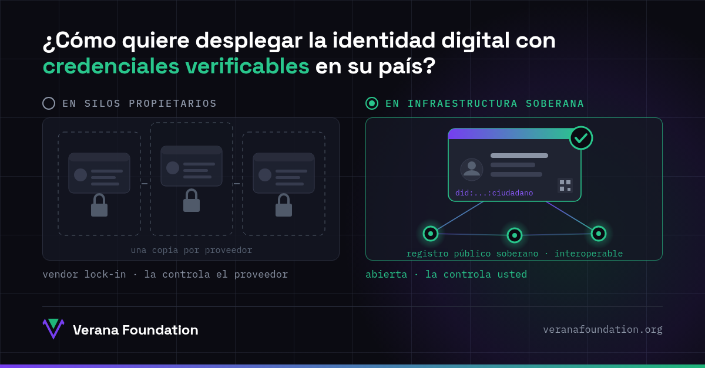

Las credenciales verificables ya son una realidad, y cada vez más gobiernos las adoptan para la identidad digital de sus ciudadanos y los registros de sus empresas. La pregunta que define todo lo demás no es si adoptarlas, sino sobre qué infraestructura desplegarlas.

## Opción 1: en silos propietarios

Cuando la identidad digital se despliega sobre una plataforma propietaria, cada servicio guarda su propia copia de la identidad del ciudadano y del registro de la empresa. Nada interopera fuera de la plataforma, las licencias suben de precio, y las decisiones tecnológicas ya no dependen del Estado sino del proveedor.

El vendor lock-in no es solo un problema técnico. Es una cesión de soberanía: quien controla la plataforma controla las reglas, los datos y la continuidad del servicio.

## Opción 2: en una infraestructura soberana

La identidad digital y los registros de empresas son infraestructura pública crítica. Y la infraestructura pública crítica debe ser controlada por quien la gobierna: reglas propias, datos propios, operación propia.

Eso es lo que permiten las credenciales verificables sobre estándares abiertos ([W3C](https://www.w3.org/), DIDs, credenciales verificables) cuando se combinan con un registro público de confianza que el propio país opera: un ecosistema soberano, interoperable con otros países y sectores, donde la credencial está en manos del ciudadano y la autoridad sigue en manos del Estado.

## El papel de la Verana Foundation

Por eso en la Verana Foundation, una organización sin fines de lucro, mantenemos una capa de confianza abierta: especificaciones abiertas sobre estándares abiertos, software de código abierto (Apache 2.0) y registros de confianza públicos que cada país puede operar como ecosistema soberano. Sin dueño, sin licencias, sin dependencia de ningún proveedor.

Del lado del ciudadano, recomendamos billeteras de código abierto. Un ejemplo: [Inji](https://inji.io), la billetera de MOSIP diseñada para escala nacional, ya integrada con la capa de confianza de Verana en nuestro [playground público](https://playground.testnet.verana.network/personal-wallets).

Su identidad. Su registro. Su infraestructura.

- Pruébelo en el playground: [playground.testnet.verana.network](https://playground.testnet.verana.network)
- Conozca la fundación: [veranafoundation.org](https://veranafoundation.org)
