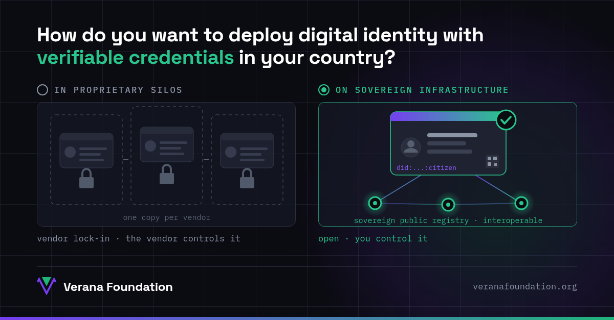

Verifiable credentials are becoming a reality, and more and more governments are adopting them for the digital identity of their citizens and the registries of their businesses. The question that defines everything else is not whether to adopt them, but on what infrastructure to deploy them.

## Option 1: in proprietary silos

When digital identity is deployed on a proprietary platform, every service keeps its own copy of the citizen's identity and of the business record. Nothing interoperates outside the platform, license costs climb, and the technology decisions no longer belong to the State but to the vendor.

Vendor lock-in is not just a technical problem. It is a cession of sovereignty: whoever controls the platform controls the rules, the data, and the continuity of the service.

## Option 2: on a sovereign infrastructure

Digital identity and business registries are critical public infrastructure. And critical public infrastructure should be controlled by whoever governs it: your own rules, your own data, your own operation.

That is what verifiable credentials on open standards ([W3C](https://www.w3.org/), DIDs, verifiable credentials) make possible when combined with a public trust registry the country itself operates: a sovereign ecosystem, interoperable with other countries and sectors, where the credential is in the citizen's hands and the authority remains with the State.

## The role of the Verana Foundation

That is why at the Verana Foundation, a non-profit organization, we maintain an open trust layer: open specifications on open standards, open-source software (Apache 2.0), and public trust registries every country can operate as a sovereign ecosystem. No owner, no licenses, no dependence on any vendor.

On the citizen side, we recommend open-source wallets. One example: [Inji](https://inji.io), MOSIP's wallet designed for national scale, already integrated with the Verana trust layer in our [public playground](https://playground.testnet.verana.network/personal-wallets).

Your identity. Your registry. Your infrastructure.

- Try it on the playground: [playground.testnet.verana.network](https://playground.testnet.verana.network)
- Learn about the Foundation: [veranafoundation.org](https://veranafoundation.org)
