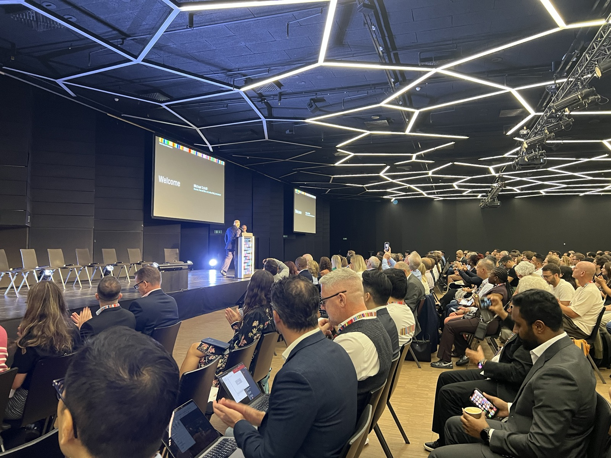
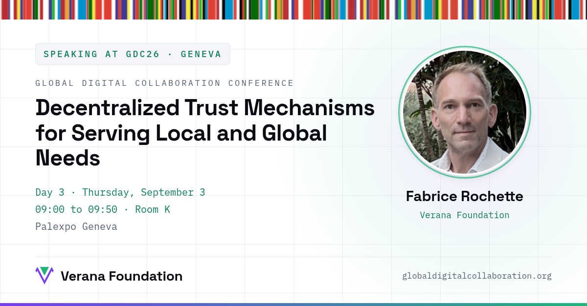

The [Global Digital Collaboration Conference](https://globaldigitalcollaboration.org/) opened on September 1 at Palexpo Geneva: three days with thousands of builders, standards bodies, and policymakers from all over the world working on digital identity, wallets, verifiable credentials, and trust infrastructure.

The Verana Foundation was there for all of it, meeting the people building trust registries, sovereign digital identity, and trust for AI agents, and showing how a public trust layer connects ecosystems across borders, live on our playground.

## On stage: decentralized trust mechanisms

On Day 3, Verana joined the session **Decentralized Trust Mechanisms for Serving Local and Global Needs**: how trust can be established, managed, and verified across ecosystems without a single central authority, through verifiable credentials, cryptographic trust registries, did:webvh, DeDi, OpenID Federation, Public Key Directories, and KERI, and how these mechanisms can serve Digital Public Infrastructure and cross-border collaboration.

We shared the stage with speakers from ICAO, First Person Cooperative, Networks for Humanity, W3C / Inria, Self-Issued Consulting, Linux Foundation Decentralized Trust, and GLEIF, in a session co-organized by UNESCO and the DPI Group (Aapti Institute, Interledger Foundation, MOSIP, Networks for Humanity).

The Verana perspective we brought: public trust registries as shared, sovereign infrastructure, where local trust requirements and global interoperability coexist through open standards.

- Conference: [globaldigitalcollaboration.org](https://globaldigitalcollaboration.org/)
- Try the trust layer yourself: [playground.testnet.verana.network](https://playground.testnet.verana.network)
