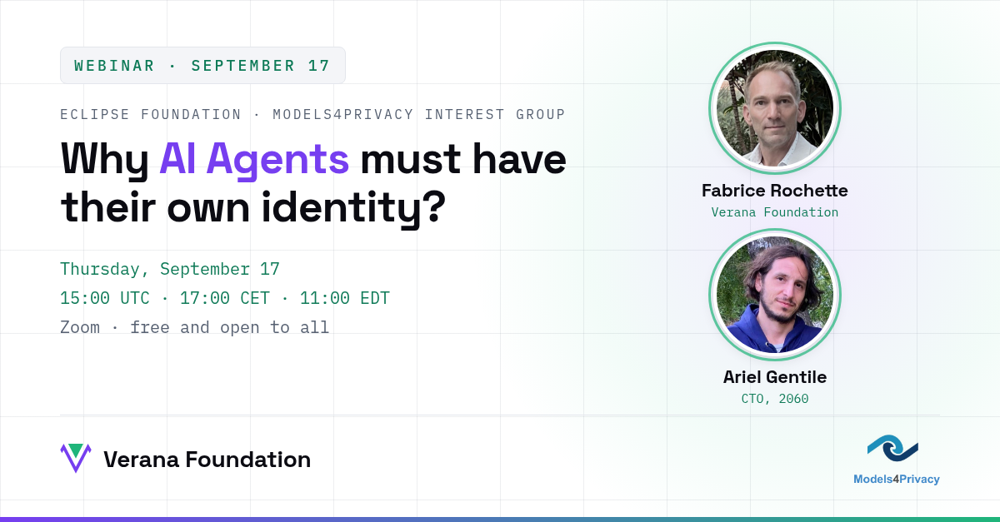

The Verana Foundation speaks at the [Eclipse Foundation's Models4Privacy Interest Group](https://models4privacy.org/) webinar on September 17: **Why AI Agents must have their own identity?**

AI agents are starting to transact, negotiate, and act on our behalf. Before each interaction, three questions need verifiable answers: Who is this agent? Who operates it? What is it allowed to do?

Answering them through a central registry creates a privacy trap: every interaction becomes linkable, detectable, and disclosable to a central observer. A decentralized public trust layer answers them instead, with verifiable credentials and cryptographic trust registries, so that trust can be verified locally, with no platform watching.

Fabrice Rochette (Verana Foundation) and Ariel Gentile (CTO, 2060) co-present, closing with an open discussion on privacy engineering for decentralized trust: threat modeling the specification, privacy vocabulary alignment, and conformance testing.

- Session: Thursday, September 17 · 15:00 UTC / 17:00 CET / 11:00 EDT, on Zoom, free and open to everyone
- Announcement and access: [models4privacy.org](https://models4privacy.org/)
