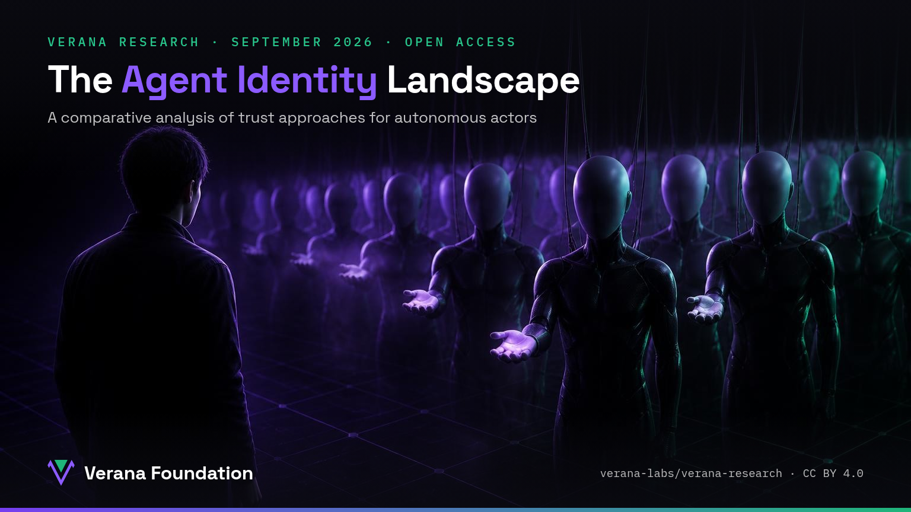

Who is this agent? Who operates it? What is it allowed to do? And can you verify all of that without a central platform watching every interaction?

We just published **[The Agent Identity Landscape, September 2026](https://verana-labs.github.io/verana-research/papers/agent-identity-landscape-2026/landscape-paper.html)**: a comparative analysis of trust approaches for autonomous actors, by Fabrice Rochette (Verana Foundation) and Ariel Gentile (2060).

## Six families, four criteria

The paper maps six deployed families of solutions:

- **Enterprise agent IAM**: Microsoft Entra Agent ID, Okta, AWS AgentCore
- **Agent directories**: A2A Agent Cards, MCP Registry, AGNTCY, ANS
- **Bot attestation**: Web Bot Auth
- **On-chain registries**: ERC-8004 Trustless Agents
- **Payment agent programs**: Visa TAP, Google AP2, Mastercard agentic tokens
- **Trust registry networks**: Ayra, DeDi

Each is evaluated against four criteria: **who it is** (a verifiable, portable identifier), **who operates it** (an accountable legal entity binding), **what it may do** (governance-backed authorizations), and **no central observer** (local verification, without platform surveillance).

## The finding

Every family solves part of the problem, and each is valuable in its own domain. But none binds an agent to an accountable operator, with verifiable authorizations, across domains, without an observer.

That last mile is exactly what a public, decentralized trust layer is for. The paper closes with Verifiable Trust as a working, open-source implementation, live on the Verana testnet.

## Read it, challenge it

The paper is open access under CC BY 4.0, and we would love your scrutiny: corrections and challenges are welcome on the repository.

- Read the paper: [The Agent Identity Landscape, September 2026](https://verana-labs.github.io/verana-research/papers/agent-identity-landscape-2026/landscape-paper.html)
- Repository: [github.com/verana-labs/verana-research](https://github.com/verana-labs/verana-research)
- Try Verifiable Trust: [playground.testnet.verana.network](https://playground.testnet.verana.network)
